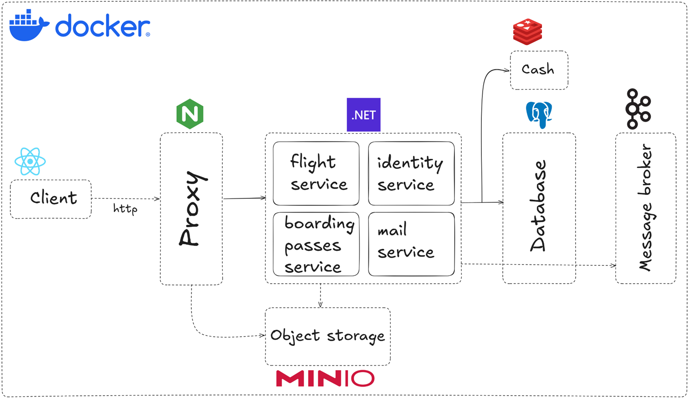

# Flight Booking Microservices System AIRVIBE

Распределенная система бронирования авиабилетов, построенная на основе микросервисной архитектуры. Проект демонстрирует использование событийно-ориентированного взаимодействия (Event-Driven) через Apache Kafka, кэширование через Redis, объектное хранилище MinIO и хранение данных в PostgreSQL.

## Архитектура системы

Система состоит из 4 независимых микросервисов бэкенда, которые взаимодействуют друг с другом исключительно асинхронно через Apache Kafka.



## Стек технологий

### Backend
- **Язык:** C# (.NET)
- **Фреймворк:** ASP.NET Core Web API
- **База данных:** PostgreSQL 15
- **Кэширование:** Redis 7
- **Брокер сообщений:** Apache Kafka (Confluent)
- **Объектное хранилище:** MinIO

### Frontend
- **Фреймворк:** React JS
- **HTTP-клиент:** Axios

### Инфраструктура и DevOps
- **Контейнеризация:** Docker, Docker Compose
- **Тестирование:** xUnit

## Описание микросервисов

### Identity Service
Отвечает за управление пользователями, аутентификацию и авторизацию. Генерирует и валидирует JWT-токены с использованием RSA-ключей (публичный/приватный). Предоставляет API для фронтенда для управления сессиями пользователей.

### Flights Service
Ядро бизнес-логики. Управляет каталогом рейсов, конфигурацией самолетов, доступностью мест. Обрабатывает создание и управление заказами (Bookings/Orders). При успешном размещении заказа публикует доменные события в Kafka.

### BoardingPasses Service
Асинхронный сервис-потребитель. Слушает события о подтверждении заказа из Kafka, генерирует посадочный талон в формате PDF и загружает его в объектное хранилище MinIO.

### Mail Service
Сервис уведомлений. Подписывается на события Kafka (например, "Заказ создан", "Посадочный талон готов") и отправляет соответствующие письма пользователям через SMTP. Интегрируется с MinIO для прикрепления сгенерированных документов (посадочных талонов) к письмам.

## Быстрый старт

### Предварительные требования
- Docker и Docker Compose
- .NET SDK
- Node.js и npm

### Конфигурация

Проект использует переменные окружения для конфигурации.
Создайте файл `.env` в корневой директории проекта и добавьте переменные как в `.env.example`

###

## Запуск приложения
Для сборки и запуска всех сервисов, баз данных и компонентов инфраструктуры выполните команду в корневой директории:
```bash
docker-compose up -d --build
```

## Точки доступа

После запуска контейнеров приложения и вспомогательные инструменты будут доступны по портам, определенным в вашем `.env` файле:

* **Frontend Application** (Основное веб-приложение)  
  `http://localhost:${FRONTEND_EXTERNAL_PORT}`

* **Kafka UI** (Управление кластером и мониторинг сообщений)  
  `http://localhost:${KAFKA_UI_EXTERNAL_PORT}`

* **MinIO Console** (UI объектного хранилища для сгенерированных PDF)  
  `http://localhost:${MINIO_EXTERNAL_CONSOLE_PORT}`

* **Swagger UI** (Интерактивная документация API для отдельных микросервисов)
    * Identity Service: `http://localhost:${IDENTITY_PORT}/swagger`
    * Flights Service: `http://localhost:${FLIGHTS_PORT}/swagger`
    * BoardingPasses Service: `http://localhost:${BOARDING_PASSES_PORT}/swagger`
    * Mail Service: `http://localhost:${MAIL_PORT}/swagger`

